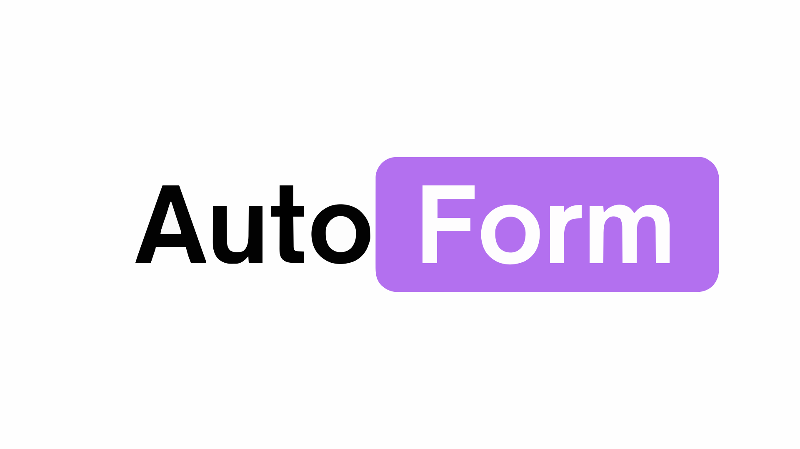

<div align="center">
  
  
  <h1>AutoForm</h1>
  <p><strong>Your AI-Powered Form Builder</strong></p>
  
  <p>
    
    
    
    
    
  </p>

  <p>
    <em>Create intelligent forms from natural language descriptions in seconds.</em>
    <br />
    <strong>No code. No complexity. Just forms.</strong>
  </p>
</div>

---

## Demo

<div align="center">

https://github.com/user-attachments/assets/placeholder-upload-video-here

> **Note:** To see the demo video, upload `frontend/public/DemoVideo.mp4` to this README by dragging it into the edit view on GitHub, or watch it live at:

**[🚀 View Live Demo → autoform.ink](https://autoform.ink)**

</div>

---

## Features

<table>
  <tr>
    <td width="33%" valign="top">
      <h3>🤖 Natural Language AI</h3>
      <p>Describe your form in plain English. Our AI understands what you need and generates the perfect form structure.</p>
    </td>
    <td width="33%" valign="top">
      <h3>📝 20+ Question Types</h3>
      <p>Short/long text, email, phone, date/time, multiple choice, checkboxes, ratings, matrix, ranking, file upload, signature, payment, and more.</p>
    </td>
    <td width="33%" valign="top">
      <h3>⚡ Smart Logic</h3>
      <p>Conditional rules, skip logic, and dynamic fields. Forms adapt based on user responses in real-time.</p>
    </td>
  </tr>
  <tr>
    <td width="33%" valign="top">
      <h3>📊 Analytics & Insights</h3>
      <p>Track submissions, view funnel analytics, completion rates, and time spent per question. Export data in CSV, Excel, or PDF.</p>
    </td>
    <td width="33%" valign="top">
      <h3>🔗 Easy Sharing</h3>
      <p>Generate shareable links instantly. Beautiful public forms with no login required for respondents.</p>
    </td>
    <td width="33%" valign="top">
      <h3>🎨 Fully Customizable</h3>
      <p>Customize colors, fonts, and layout. Inline markdown editing for rich text. Clean, modern interface that works on any device.</p>
    </td>
  </tr>
</table>

---

## How It Works

### Building forms is as easy as 1, 2, 3

> From idea to live form in minutes. No technical skills required.

#### **01. Describe Your Form**
Tell us what kind of form you need in plain language.
- Natural language processing understands your intent
- Examples: "Wedding RSVP with meal preferences", "Job application with resume upload"
- AI suggests appropriate question types
- Context-aware field generation
- Chat-based refinement available

#### **02. Review & Customize**
Get instant form generation and refine as needed.
- 20+ question types supported
- Inline markdown editing for rich text
- Add conditional logic and validation rules
- Customize colors, backgrounds, and button styles
- AI-powered editing via chat interface
- Component library for quick additions

#### **03. Share & Collect**
Publish your form and start collecting responses.
- Generate shareable link instantly
- Beautiful, customizable public forms
- No login required for respondents
- Real-time response tracking
- Auto-save submissions (prevents data loss)
- Export responses as CSV, Excel, or PDF
- View analytics and completion funnels

---

## Supported Question Types

**Text Input Fields**
- 📝 Short Text
- 📄 Long Text (Textarea)
- 📧 Email
- 📞 Phone Number
- 🔗 URL/Link
- 🔢 Number Input

**Selection & Choice**
- ⭕ Multiple Choice (Radio)
- ☑️ Checkboxes
- 📋 Dropdown Menu
- 🎯 Multi-select Dropdown

**Date & Time**
- 📅 Date Picker
- ⏰ Time Picker

**Ratings & Scales**
- ⭐ Rating (Star/Heart/Thumbs)
- 📊 Linear Scale
- 📈 Matrix (Grid)
- 🔀 Ranking

**Advanced**
- 📎 File Upload
- ✍️ Signature Pad
- 💳 Payment Integration
- 🔗 Wallet Connect (Web3)
- 📍 Section Header (for organization)

---

## Why AutoForm?

<table>
  <tr>
    <td width="33%" align="center">
      <h3>No Code Required</h3>
      <p>Built for everyone—from analysts to executives. If you can describe it, we can create it.</p>
    </td>
    <td width="33%" align="center">
      <h3>Lightning Fast</h3>
      <p>Go from idea to live form in under 60 seconds. Our AI handles all the heavy lifting.</p>
    </td>
    <td width="33%" align="center">
      <h3>Enterprise Ready</h3>
      <p>Secure, scalable, and built with production workloads in mind. OAuth authentication included.</p>
    </td>
  </tr>
</table>

---

## Tech Stack

### Frontend
- **React** + **TypeScript** - Modern, type-safe UI
- **React Router** - Seamless navigation
- **Vite** - Lightning-fast build tool

### Backend
- **FastAPI** - High-performance Python API
- **DSPy** - AI-powered form generation
- **SQLAlchemy** - Database ORM
- **PostgreSQL/SQLite** - Reliable data storage

### AI & Intelligence
- **DSPy Framework** - Advanced AI orchestration for form generation
- **OpenAI GPT-4** - Natural language understanding
- **Smart Field Generation** - Automatic question type detection
- **Validation Rules** - Context-aware field validation
- **Conditional Logic** - Dynamic form behavior
- **Chat-based Editing** - Conversational form refinement

---

## Installation

### Prerequisites
- **Node.js** 18+ and **npm**
- **Python** 3.9+
- **Git**

### Clone the Repository
```bash
git clone https://github.com/FireBird-Technologies/AutoForm.git
cd AutoForm
```

### Backend Setup
```bash
cd backend

# Create and activate virtual environment
python -m venv venv
# On Windows:
venv\Scripts\activate
# On macOS/Linux:
source venv/bin/activate

# Install dependencies
pip install -r requirements.txt

# Set up environment variables
# Create a .env file with the following:
# - OPENAI_API_KEY=your_openai_key
# - GOOGLE_CLIENT_ID=your_google_client_id
# - GOOGLE_CLIENT_SECRET=your_google_client_secret
# - SECRET_KEY=your_secret_key
# - DATABASE_URL=sqlite:///./chat.db (or your PostgreSQL URL)

# Run the backend
uvicorn app.main:app --reload --port 8000
```

The backend will start on `http://localhost:8000`

**API Documentation:** Visit `http://localhost:8000/docs` for interactive API documentation.

### Frontend Setup
```bash
cd frontend
npm install

# Run the development server
npm run dev
```

The frontend will start on `http://localhost:5173`

---

## Usage

1. **Start the Application**
   - Navigate to `http://localhost:5173`
   - Sign in with Google

2. **Create Your Form**
   - Click "Create Forms for free"
   - Describe your form in plain English
   - Examples:
     - "Customer satisfaction survey with rating and feedback"
     - "Event registration form with name, email, and dietary preferences"
     - "Job application form with resume upload"

3. **Customize & Share**
   - Review generated questions
   - Add conditional logic if needed
   - Generate shareable link
   - Start collecting responses

---

## Contributing

We welcome contributions! Please see our [Contributing Guidelines](CONTRIBUTING.md) for details.

### Development Workflow
1. Fork the repository
2. Create a feature branch (`git checkout -b feature/amazing-feature`)
3. Commit your changes (`git commit -m 'Add amazing feature'`)
4. Push to the branch (`git push origin feature/amazing-feature`)
5. Open a Pull Request

---

## License

This project is licensed under the MIT License - see the [LICENSE](LICENSE) file for details.

---

## Acknowledgments

- **FastAPI** - For the blazing-fast Python framework
- **DSPy** - For AI-powered form generation
- **React** - For the excellent UI library
- **Open Source Community** - For inspiration and support

---

<div align="center">
  <h3>Ready to build intelligent forms?</h3>
  <p><strong>Join thousands of teams making data-driven decisions faster.</strong></p>
  
  <p>
    <a href="https://github.com/FireBird-Technologies/AutoForm">⭐ Star on GitHub</a> •
    <a href="#installation">🚀 Get Started</a> •
    <a href="https://github.com/FireBird-Technologies/AutoForm/issues">🐛 Report Bug</a> •
    <a href="https://github.com/FireBird-Technologies/AutoForm/issues">💡 Request Feature</a>
  </p>

  <p>
    <sub>Built with ❤️ by FireBird Technologies</sub>
  </p>
</div>


